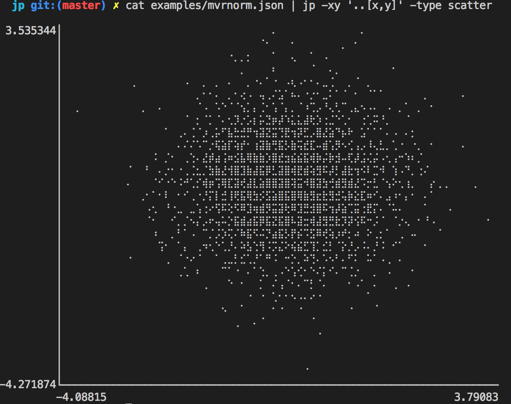
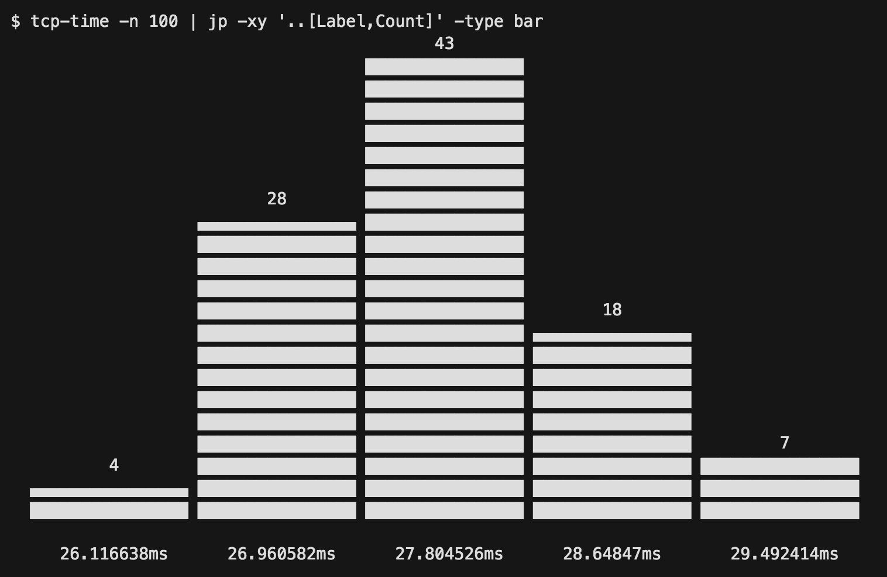
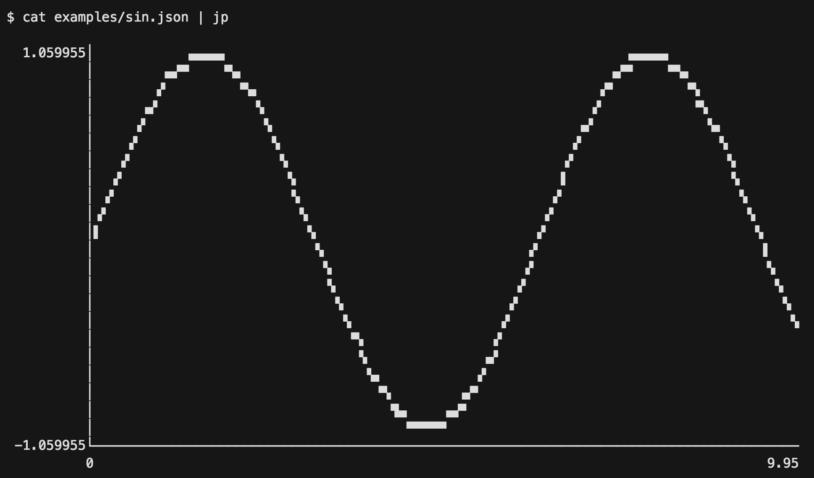

# jp

Dead simple terminal plots from JSON data. Bar charts and line charts are supported.

<!-- TOC -->

- [Get it](#get-it)
- [Use it](#use-it)
- [Examples](#examples)
    - [Screenshots](#screenshots)
    - [Bar chart](#bar-chart)
        - [Separate X and Y values](#separate-x-and-y-values)
        - [XY pairs](#xy-pairs)
        - [Y values only (X=index)](#y-values-only-xindex)
        - [Array data](#array-data)
    - [Line chart](#line-chart)
        - [Array data, separate X and Y values](#array-data-separate-x-and-y-values)
        - [Array data, XY pairs](#array-data-xy-pairs)
        - [Y values only (X=index)](#y-values-only-xindex-1)
    - [Scatter plot](#scatter-plot)

<!-- /TOC -->

## Get it

```bash
go get -u github.com/sgreben/jp/cmd/jp
```

Or [download the binary](https://github.com/sgreben/jp/releases/latest) from the releases page. 

```bash
# Linux
curl -LO https://github.com/sgreben/jp/releases/download/1.1.0/jp_1.1.0_linux_x86_64.zip
unzip jp_1.1.0_linux_x86_64.zip

# OS X
curl -LO https://github.com/sgreben/jp/releases/download/1.1.0/jp_1.1.0_osx_x86_64.zip
unzip jp_1.1.0_osx_x86_64.zip

# Windows
curl -LO https://github.com/sgreben/jp/releases/download/1.1.0/jp_1.1.0_windows_x86_64.zip
unzip jp_1.1.0_windows_x86_64.zip
```

## Use it

`jp` reads JSON on stdin and prints plots to stdout.

```text
Usage of jp:
  -type value
    	Plot type. One of [line bar scatter] (default line)
  -x string
    	x values (JSONPath expression)
  -y string
    	y values (JSONPath expression)
  -xy string
    	x,y value pairs (JSONPath expression). Overrides -x and -y if given.
  -height int
    	Plot height (default 0 (auto))
  -width int
    	Plot width (default 0 (auto))
  -canvas value
    	Canvas type. One of [full quarter braille auto] (default auto)
```

## Examples

### Screenshots

In case you're on mobile, here's some PNGs of what `jp` output looks like:

- 
- 
- 

### Bar chart

#### Separate X and Y values

```bash
$ cat examples/tcp-time.json | jp -x ..Label -y ..Count -type bar

         69                                                                     
    █████████████                                                               
    █████████████                                                               
    █████████████                                                               
    █████████████                                                               
    █████████████                                                               
    █████████████      21                                                       
    █████████████ █████████████       7             2             1             
    █████████████ █████████████ ▄▄▄▄▄▄▄▄▄▄▄▄▄ ▁▁▁▁▁▁▁▁▁▁▁▁▁ ▁▁▁▁▁▁▁▁▁▁▁▁▁       
                                                                                
     46.85267ms    48.38578ms    49.91889ms     51.452ms     52.98511ms         
```


#### XY pairs

```bash
$ cat examples/tcp-time.json | jp -xy "..[Label,Count]" -type bar

         69                                                                     
    █████████████                                                               
    █████████████                                                               
    █████████████                                                               
    █████████████                                                               
    █████████████                                                               
    █████████████      21                                                       
    █████████████ █████████████       7             2             1             
    █████████████ █████████████ ▄▄▄▄▄▄▄▄▄▄▄▄▄ ▁▁▁▁▁▁▁▁▁▁▁▁▁ ▁▁▁▁▁▁▁▁▁▁▁▁▁       
                                                                                
     46.85267ms    48.38578ms    49.91889ms     51.452ms     52.98511ms                
```

#### Y values only (X=index)

```bash
$ cat examples/tcp-time.json | jp -y ..Count -type bar

         69                                                                     
    █████████████                                                               
    █████████████                                                               
    █████████████                                                               
    █████████████                                                               
    █████████████                                                               
    █████████████      21                                                       
    █████████████ █████████████       7             2             1             
    █████████████ █████████████ ▄▄▄▄▄▄▄▄▄▄▄▄▄ ▁▁▁▁▁▁▁▁▁▁▁▁▁ ▁▁▁▁▁▁▁▁▁▁▁▁▁       
                                                                                
          0             1             2             3             4             
```

#### Array data

```bash
$ echo '[[-3, 5], [-2, 0], [-1, 0.1], [0, 1], [1, 2], [2, 3]]' | jp -xy '[*][0, 1]' -type bar

         5                                                                      
    ███████████                                                                 
    ███████████                                                                 
    ███████████                                                      3          
    ███████████                                                 ▄▄▄▄▄▄▄▄▄▄▄     
    ███████████                                          2      ███████████     
    ███████████                              1      ███████████ ███████████     
    ███████████                 0.1     ▄▄▄▄▄▄▄▄▄▄▄ ███████████ ███████████     
    ███████████      0      ▁▁▁▁▁▁▁▁▁▁▁ ███████████ ███████████ ███████████     
                                                                                
        -3          -2          -1           0           1           2          
```

### Line chart

#### Array data, separate X and Y values

```bash
$ jq -n '[range(200)/20 | [., sin]]' | jp -x '[*][0]' -y '[*][1]'

  1.059955│        ▄▄▄▄▖                                    ▄▄▄▄▖               
          │      ▗▀    ▝▚▖                                ▗▛▘   ▝▚▖             
          │     ▟▘       ▀▖                              ▄▘       ▝▖            
          │    ▟          ▝▖                            ▞▘         ▝▖           
          │   ▟            ▝▖                          ▞▘           ▝▖          
          │  ▐              ▐                         ▗▘             ▐▖         
          │ ▐▘               ▚                       ▗▘               ▐         
          │▗▘                 ▚                      ▞                 ▚        
          │▞                  ▝▖                    ▞                   ▌       
          │                    ▝▖                  ▐                    ▝▖      
          │                     ▐                 ▗▘                     ▀▖     
          │                      ▚               ▗▘                       ▚     
          │                       ▚             ▗▞                         ▙    
          │                       ▝▚            ▞                           ▘   
          │                        ▝▄         ▗▞                                
          │                         ▝▙        ▞                                 
          │                           ▚▖    ▄▛                                  
          │                            ▝▀▀▀▀▘                                   
 -1.059955└─────────────────────────────────────────────────────────────────────
          0                                                               10.547
```

#### Array data, XY pairs

```bash
$ jq -n '[range(200)/20 | [., sin]]' | jp -xy '[*][0, 1]'

  1.059955│        ▄▄▄▄▖                                    ▄▄▄▄▖               
          │      ▗▀    ▝▚▖                                ▗▛▘   ▝▚▖             
          │     ▟▘       ▀▖                              ▄▘       ▝▖            
          │    ▟          ▝▖                            ▞▘         ▝▖           
          │   ▟            ▝▖                          ▞▘           ▝▖          
          │  ▐              ▐                         ▗▘             ▐▖         
          │ ▐▘               ▚                       ▗▘               ▐         
          │▗▘                 ▚                      ▞                 ▚        
          │▞                  ▝▖                    ▞                   ▌       
          │                    ▝▖                  ▐                    ▝▖      
          │                     ▐                 ▗▘                     ▀▖     
          │                      ▚               ▗▘                       ▚     
          │                       ▚             ▗▞                         ▙    
          │                       ▝▚            ▞                           ▘   
          │                        ▝▄         ▗▞                                
          │                         ▝▙        ▞                                 
          │                           ▚▖    ▄▛                                  
          │                            ▝▀▀▀▀▘                                   
 -1.059955└─────────────────────────────────────────────────────────────────────
          0                                                               10.547
```

#### Y values only (X=index)

```bash
$ cat examples/tcp-time.json | jp -y ..Duration

 5.342888e+07│▐▌                                                                
             │▐▌                                                                
             │▐▐                                                                
             │▐▐                           ▐                                    
             │▐▐                           ▐                                    
             │▐▐                           ▐                                    
             │▐▐                           ▐                                    
             │▞▐                           ▐▖                                   
             │▌▐                           ▐▌                                   
             │▌▐                           ▐▌                                   
             │▌▐                           ▞▌   ▌                               
             │▌▐             ▗     ▄       ▌▌   ▌                               
             │▘▐           ▗ ▐    ▞▐       ▌▌   ▌                               
             │ ▐      ▗    ▟ █    ▌▐       ▌▌  ▗▌                               
             │ ▐   ▙  ▐▌   █ █    ▌▐   ▟   ▌▌  ▐▌                               
             │  ▌  ▛▖ ▐▐  ▗▜ █    ▌ ▌▗ █   ▌▌  ▐▌                               
             │  ▌ ▟ ▚ ▌▐▗ ▐▝▟▐    ▌ ▌▟▐ ▌  ▌▚  ▐▌                 ▖             
             │  ▌ █ ▐ ▌▐▐▌▐ █ ▌▗ ▐  ▌▛▟ ▌▗ ▌▐  ▐▐                 ▌             
             │  ▌▗▀ ▝▄▘ ▛▐▌ ▛ ▌▟ ▐  ▀ ▌ ▌▐ ▌▐  ▐▐                ▗▚             
             │  ▌▐   ▘  ▌ ▘ ▌ ▌█ ▐    ▘ ▐▛▖▌▐  ▐▐  ▗▌ ▖     ▖    ▐▐             
             │  ▙▐      ▘   ▘ █▐ ▐      ▝▌▌▌▐▄ ▞▐  ▌▌▗▜    ▐▌    ▐▐  ▗▖         
             │  ▜▐            ▌ ▌▟        █   ▌▌▐ ▄▘▚▐▐ ▗▄ ▌▐▖ ▗ ▞▐▐ ▞▚  ▗ ▖▗▌▐▄
             │  ▝▞              ▙▘        ▜   ▐▌▐▐▜ ▐▞ ▌▐▝▟  ▝▄▀▄▘▝▞▀▘▝▖ ▞▄▌▌▌▌ 
             │   ▌              ▛         ▐    ▌▐▌▝ ▝▌ ▚▌          ▌   ▚▞▘▜▐ ▐▘ 
             │   ▘              ▘         ▝            ▝▌          ▘   ▝     ▝  
             │                                                                  
             │                                                                  
             │                                                                  
 4.591664e+07└──────────────────────────────────────────────────────────────────
             0                                                             97.02
```

### Scatter plot

```bash
$ cat examples/mvrnorm.json | jp -xy '..[x,y]' -type scatter

 3.535344│                                 ⠄             ⠄                     
         │                               ⠈⠂   ⠂       ⡀ ⠂                      
         │                          ⠐⡀⡀⡂   ⠁  ⢄  ⠁ ⠠                           
         │                            ⡀    ⠆     ⠈  ⠄⡀        ⠂                
         │           ⡀       ⠠  ⡀ ⡀ ⠄  ⡀⠐⠄⠁⠐ ⠠⢆⠠⠂⠂⠄⣀⢈  ⡀⠈ ⡀                    
         │                     ⡀⠂⠂⠄ ⡀⠂⢔⠠ ⢤⢀⠌⣡⠁⠦⠄⠐⡐⠂⣀⠅⠁⠈ ⠂ ⠈⠁⠁      ⡀     ⠄     
         │  ⡀         ⢀  ⠄     ⠈⠠ ⠡⠑⠈⠈⢢⡁⡄⢈⠂⢡⠈⡄⡀⠈⠰⢉⡠⠘⢄⢃⠉⢀⣄⠢⠠⠄ ⠠ ⡀⠁ ⡀ ⠂          
         │                   ⠈ ⡂⠈⡁⠈⠄⢂⡹⡐⡡⡆⡥⣙⡶⡼⠱⣅⣅⣼⢗⡱⢐⣈⠑⢁⠂ ⢐⢁⠭⠘⡀  ⠈              
         │                ⠁ ⢀⠄⢈⠈⡰⢀⡥⠋⣧⣓⣚⡛⢲⣽⣝⣭⢙⣟⢲⡽⣋⡠⣿⣜⣵⠙⡦⠗ ⣡⠁⠁⠁⠄⠠ ⠄⡂             
         │                  ⠄⠌⠌⠡⠉⡐⢯⣵⡏⢵⡞⠂⢰⣽⣷⢛⣯⡣⣷⢭⣞⣏⠤⣾⢡⡻⠢⢊⢠⡠⠸⢄⣃⡀⢁⠐ ⠐⡀ ⠂    ⠄     
         │              ⠨ ⡈⠂ ⢀⢑⠄⣜⡾⣴⢨⠶⣪⣧⢿⣷⣷⡱⣿⣞⣲⣮⣮⣯⢾⡷⡬⡷⣺⠤⢏⡼⣨⢌⡬⠠⢂⢠⠒⠱⠆⡈            
         │          ⠈  ⠃ ⠄⡐⠂⠐⢀⢈⣂⡈⣳⣷⣜⢺⣿⣹⣷⣼⣯⡿⣃⣽⣿⢾⣟⣾⢵⣻⠯⡼⡃⣼⣗⢲⠪⠇⣉⠺ ⢱⠠⠙⡀⢐⠌           
         │          ⠄   ⠈⠊⠐⠑⠨⠚⢁⡊⢾⡶⢩⢿⣏⣽⢞⣼⣇⣵⣿⣿⣽⣿⢽⣭⠺⣿⣽⣳⢚⣾⣻⣾⣜⠩⡒⣃⠈⢢⠕⢂⢰⡀  ⡔⢀⢀    ⡀   
         │            ⢀⠂⠁⠂⠇ ⠂⠊⢀⠐⡘⡍⡇⣚⢸⢟⣯⢿⣳⡪⣫⣵⣿⣯⣿⢿⣷⣻⣖⣗⣻⣚⢥⡷⣕⣏⠶⠊⠄⣠⠰⠂⡄⠂ ⠄⠁          
         │             ⠠⢂ ⠘⠐⣀ ⣀⢡⢐⠔⢫⠯⢕⠫⠿⣹⢶⣾⡻⣭⣽⢗⠿⣹⣛⣺⣿⠯⢲⡼⣵⢉⣭⢐⣟⡍⠄⠈⠥⠄   ⠁   ⠄       
         │             ⠈⠂  ⠊⡀⡈⠢⡌⡠⠖⢤⠥⡑⣯⣾⣴⣯⡿⣯⣝⣯⣿⠧⣽⣒⢾⣼⣻⣛⣗⡹⡽⢪⠯⠒⡨⠈ ⠈⡐⢄ ⠂⠘⠠        ⠂ 
         │              ⠰  ⡀⠃⠁⠠ ⠉⡈⡨⡱⢍⠌⠷⣯⠫⠬⡙⣴⣯⡣⡟⡮⠩⣫⠿⢞⢵⡰⠞⡂⠴ ⠕⢀⡂⠁ ⢀ ⠤   ⠈         
         │               ⢩⠂ ⠁⡄ ⢀⠲⢂⠑⢁⡘⠄⠵⣣⢑⢻⠨⡩⣌⠕⢮⣮⣋⢹⡁⣊⡃⠈⡕⡘⡠⠨⠄⡘⠨ ⠊⠁   ⠂           
         │          ⠐     ⢀ ⠈⠐⠔⠈  ⠁⢀⣀⡃⣊⢁⡘⠁⠛⠨ ⠒⡑⡀⠵⢙⠄⠡⠢⠃⠄⠋⠅ ⠥⠁⠠⢀ ⠄               
         │                  ⢀⢁ ⠆   ⠉⠁⠐ ⠄⠁⢑⡀⢀⠠⠑⢡⢊⠂⠑⠌⡅⠊⠄⠉⢈⡐  ⡀ ⠠   ⠂             
         │                      ⢀   ⠑ ⠂  ⡁ ⠌⢠⠈⠂⠄⠉⡃⠈⠄   ⠂⠠⠁ ⠄  ⢀ ⠠              
         │                             ⠐ ⠐ ⢁⠂⠂⠢⠠⠄⠔⠐       ⠁                    
         │                         ⠢  ⠁    ⠂⠐  ⠐       ⠐   ⠈                   
         │                           ⢀  ⠄⠈       ⠈                             
         │                                        ⠐                            
         │                                                                     
         │                                                                     
         │                                      ⠈                              
-4.271874└─────────────────────────────────────────────────────────────────────
          -4.08815                                                       3.79083
```